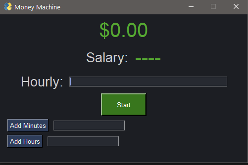
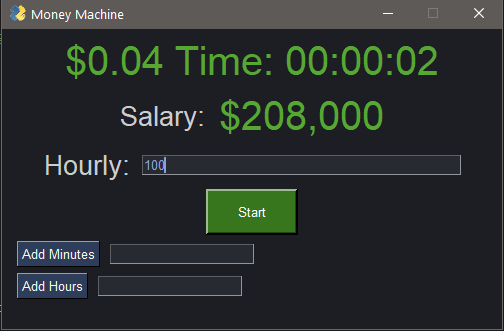

# WAGE DISPLAY
-PysimpleGUI
Wage display was created to help visualize your income.
How many cents do you make per second? How long would an hour feel if you just watched your income?
What is it like to make $1000 an hour?
These questions are answered in a visual display to help understand your income.

Simply enter the desired wage amount, and hit start. Add minutes or hours to see faster progress. 
Stopping will pause the timers, and start will reset it with the new wage.
Salary will update when wage is changed
You can change wage while the timer is active. 
The exit button will close the program.

